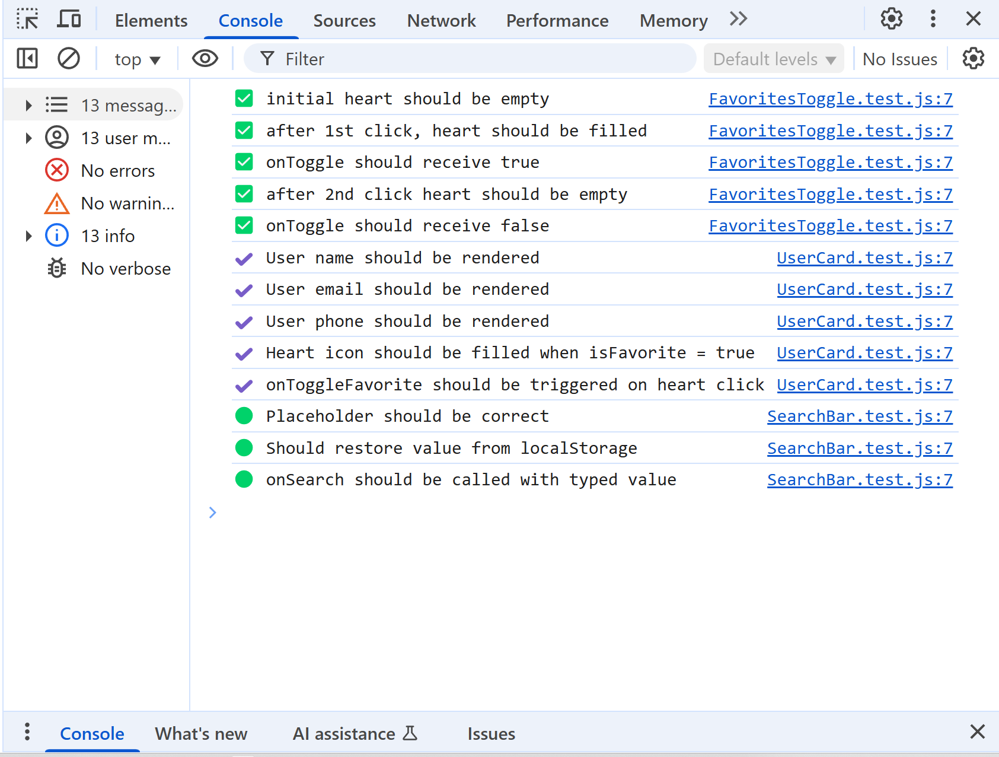

# 👤 User Explorer

## 📸 Application preview


## 🎥 Application demo


---

### 📌 Project Description

A modern **vanilla JavaScript** frontend application for **browsing**, **sorting**, **searching**, and **favoriting users**.  
Includes features like **dark mode**, a **“show favorites”** filter, a **loading spinner**, and **persistent user preferences** saved in `localStorage`.  
Also includes a set of **unit tests for key components**, written without any frameworks – just **clean, browser-native JS**.  
Built entirely without frameworks – just **HTML**, **CSS**, and **JavaScript**.

---

### ⚙️ Features

✔️ Fetch user data from **JSONPlaceholder API**  
✔️ **Real-time search** by user name  
✔️ **Alphabetical sorting** A–Z / Z–A  
✔️ Toggle between **dark** and **light** mode  
✔️ **Favorite users** – mark with a heart  
✔️ **Filter favorites** – show only liked users  
✔️ **Save preferences** in `localStorage` (sort, theme, favorites)  
✔️ **Loading spinner** and "Done!" toast notification  
✔️ Custom **favicon** for a polished look  
✔️ 🧪 **Unit tests** for toggle, input, and card components

---

### 🚀 Getting Started

1. **Clone the repository**:

   ```bash
   git clone https://github.com/Kornetas/user-explorer.git
   ```

2. **Install dependencies**:

   ```bash
   npm install
   ```

3. **Start the app**:

   ```bash
   npm start
   ```

4. **The app will be available**: [http://127.0.0.1:8080](http://127.0.0.1:8080)

✅ Done! 🎉

### 🛠️ Technologies Used

| ✅  | Technologia                  | Opis                                       |
| --- | ---------------------------- | ------------------------------------------ |
| ✅  | **HTML5**                    | App structure                              |
| ✅  | **CSS3**                     | Styling, dark mode 🌙, animations          |
| ✅  | **JavaScript (ES6 Modules)** | Logic, components, event handling          |
| ✅  | **Axios**                    | Fetching data from API                     |
| ✅  | **http-server**              | Local dev server                           |
| ✅  | **LocalStorage**             | Persisting UI state                        |
| ✅  | **Vanilla JS Unit Tests**    | Testing component logic without frameworks |

### 🗂️ Project Structure

| Folder / File               | Description                                      |
| --------------------------- | ------------------------------------------------ |
| 📁 `src/`                   | Main application logic                           |
| ┣ 📁 `components/`          | UI components (inputs, toggles, spinners, etc.)  |
| ┃ ┣ `FavoritesToggle.js`    | "Show favorites" heart toggle                    |
| ┃ ┣ `Header.js`             | Top bar with sort, theme, and search controls    |
| ┃ ┣ `SearchBar.js`          | Search input with localStorage integration       |
| ┃ ┣ `Spinner.js`            | Dual ring loading animation                      |
| ┃ ┣ `Toast.js`              | "Done!" toast notification                       |
| ┃ ┣ `UserCard.js`           | Single user card component                       |
| ┃ ┗ `UserList.js`           | Renders filtered and sorted user cards           |
| ┣ 📁 `services/`            | API logic                                        |
| ┃ ┗ `api.js`                | Fetch users from JSONPlaceholder                 |
| ┣ `app.js`                  | App logic, state, and render control             |
| ┗ `main.js`                 | Entry point – initializes the app                |
| 📁 `tests/`                 | Unit tests written in vanilla JavaScript         |
| ┣ `FavoritesToggle.test.js` | Tests toggle logic and icon rendering            |
| ┣ `UserCard.test.js`        | DOM tests for card rendering and favorite click  |
| ┣ `SearchBar.test.js`       | Tests input behavior, localStorage, and callback |
| ┗ `index.html`              | Simple test runner to load tests in the browser  |
| `index.html`                | Main HTML layout                                 |
| `styles.css`                | Styling (layout, colors, transitions, dark mode) |
| `package.json`              | Project config, metadata, and npm scripts        |
| `package-lock.json`         | Auto-generated dependencies lock file            |
| `README.md`                 | Project documentation                            |

---

### 🧪 Tests

This project includes **unit tests written in pure vanilla JavaScript**, without any frameworks like Jest or Mocha.  
Tests are fully browser-based and check the behavior of interactive components.

| File                            | Description                                        |
| ------------------------------- | -------------------------------------------------- |
| `tests/FavoritesToggle.test.js` | Tests the toggle logic and emoji state (`❤️/🤍`)   |
| `tests/UserCard.test.js`        | Ensures the user card renders and heart icon works |
| `tests/SearchBar.test.js`       | Verifies input behavior and callback execution     |
| `tests/index.html`              | Minimal runner – open in browser and view console  |

> ✅ To run tests, open `tests/index.html` in your browser and check the DevTools console (`F12`).


### 🧪 Test Preview

The following screenshot shows how the unit tests are executed directly in the browser using the custom test runner:


