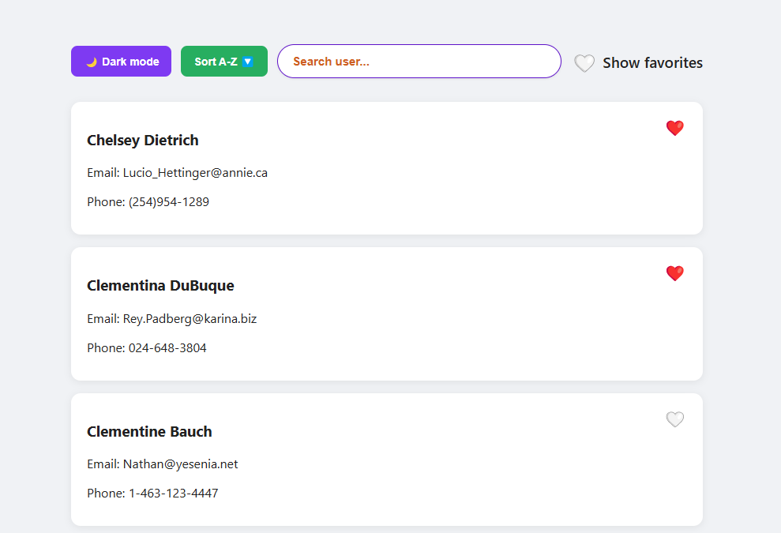
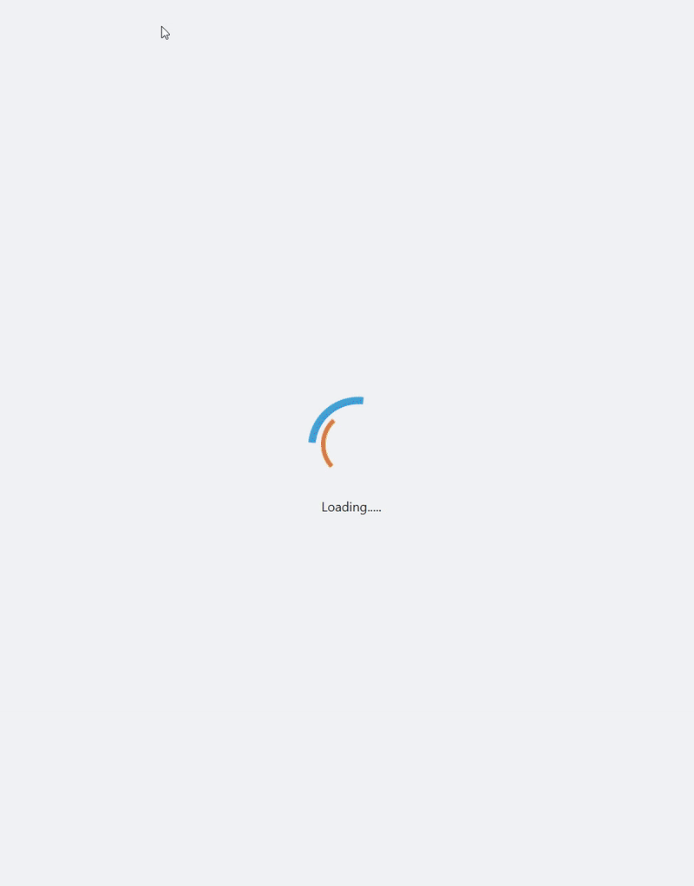

# 🧭 User Explorer

## 📸 Podgląd aplikacji



## 🎥 Demo działania aplikacji



---

### 📌 Opis projektu

User Explorer to aplikacja frontendowa, która umożliwia **przeglądanie, sortowanie, wyszukiwanie oraz oznaczanie ulubionych użytkowników**.  
Wspiera **tryb ciemny 🌙**, filtr **„Pokaż ulubionych” ❤️**, pamięta ustawienia w `localStorage`, a wszystko zbudowane jest w czystym JavaScript bez frameworków.

---

### ⚙️ Funkcje

✅ Pobieranie danych użytkowników z **JSONPlaceholder API**  
✅ **Wyszukiwanie użytkowników** w czasie rzeczywistym  
✅ **Sortowanie alfabetyczne A-Z / Z-A ↕️**  
✅ **Tryb ciemny 🌙 / jasny ☀️**  
✅ **Ulubieni użytkownicy** – oznaczenie serduszkiem ❤️  
✅ **Filtrowanie ulubionych** – pokaż tylko ❤️  
✅ **Zapamiętywanie ustawień** w `localStorage` (sort, tryb, ulubieni)  
✅ **Spinner ładowania** oraz toast „Gotowe! ✅”  
✅ **Favicon** – estetyczna ikonka w zakładce przeglądarki 👤

---

### 🚀 Uruchomienie projektu

1. **Sklonuj repozytorium** (jeśli używasz GitHub):

   ```bash
   git clone https://github.com/Kornetas/user-explorer.git
   ```

2. **Otwórz projekt** w edytorze (np. Visual Studio Code) i przejdź do folderu projektu.

3. **Zainstaluj zależności**:

   ```bash
   npm install
   ```

4. **Uruchom aplikację**:

   ```bash
   npm start
   ```

5. **Aplikacja będzie dostępna pod adresem**: [http://127.0.0.1:8080](http://127.0.0.1:8080)

✅ Gotowe! 🎉


### 🛠️ Technologie


| ✅ | Technologia                 | Opis                                                             |
|----|-----------------------------|------------------------------------------------------------------|
| ✅ | **HTML5**                   | Struktura aplikacji                                              |
| ✅ | **CSS3**                    | Stylizacja + tryb ciemny 🌙 + animacje                           |
| ✅ | **JavaScript (ES6 Modules)**| Logika, komponenty                                               |
| ✅ | **Axios**                   | Pobieranie danych z API                                          |
| ✅ | **http-server**             | Prosty serwer lokalny do uruchamiania projektu                   |
| ✅ | **LocalStorage**            | Zapamiętywanie ustawień (sort, tryb, ulubieni)                   |


### 🗂️ Struktura projektu


| Folder / Plik             | Opis                                                                 |
|---------------------------|----------------------------------------------------------------------|
| 📁 `src/`                 | Główna logika aplikacji                                              |
| ┣ 📁 `components/`        | Komponenty UI (pola, karty, przełączniki itp.)                       |
| ┃ ┣ `FavoritesToggle.js`  | Przełącznik „Pokaż ulubionych”                                       |
| ┃ ┣ `Header.js`           | Pasek górny z przyciskami i wyszukiwarką                             |
| ┃ ┣ `SearchBar.js`        | Komponent pola wyszukiwania                                          |
| ┃ ┣ `Spinner.js`          | Spinner ładowania                                                    |
| ┃ ┣ `Toast.js`            | Powiadomienie „Gotowe!” ✅                                           |
| ┃ ┣ `UserCard.js`         | Pojedyncza karta użytkownika                                         |
| ┃ ┗ `UserList.js`         | Lista użytkowników                                                   |
| ┣ 📁 `services/`          | Logika komunikacji z zewnętrznym API                                 |
| ┃ ┗ `api.js`              | Pobieranie danych z JSONPlaceholder API                              |
| ┣ `app.js`                | Główna logika aplikacji, renderowanie                                |
| ┣ `main.js`               | Punkt wejściowy, inicjalizacja (`initApp`)                           |
| 📄 `index.html`           | Struktura strony                                                     |
| 📄 `styles.css`           | Stylizacja aplikacji (ciemny motyw, layout, animacje)                |
| 📄 `package.json`         | Konfiguracja projektu i skrypty (`npm start`)                        |
| 📄 `package-lock.json`    | Automatycznie generowany przez `npm install`                         |
| 📄 `README.md`            | Dokumentacja projektu (ten plik!)                                   |
